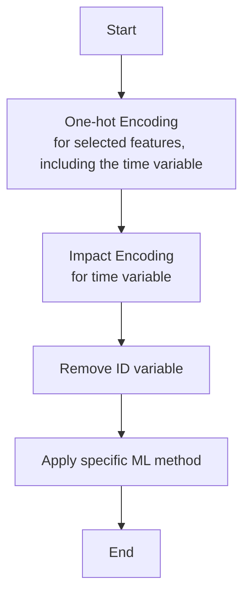
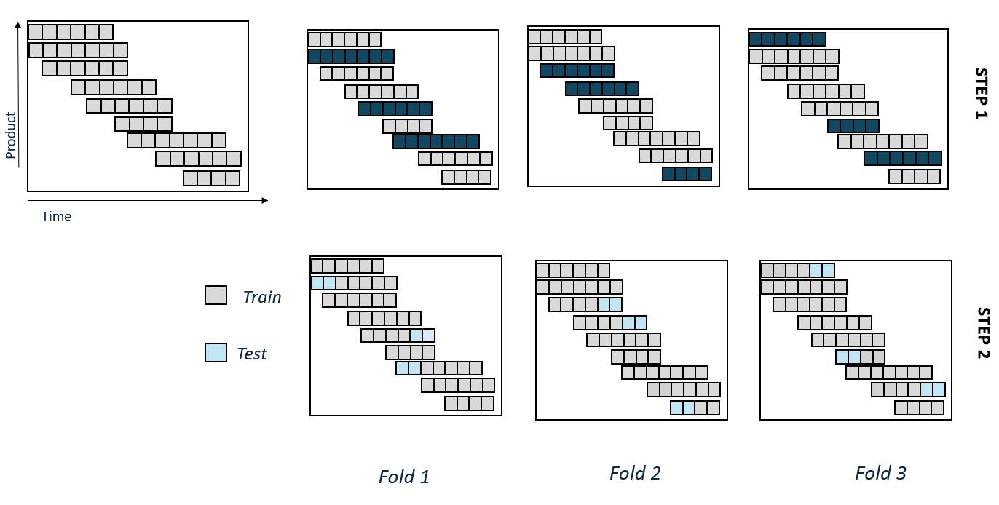
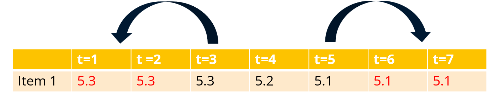

# WP9S2LU_Price
## Price indices with ML based imputation

Price indices are traditionally constructed by comparing the prices of identical products across two time periods. However, in markets with dynamic product assortments, this matched-model approach — limited to products available in both periods — can be insufficient. To address this, prices can be imputed for products that appear in only one of the two comparison periods.

Imputed prices are typically estimated using models that relate observed prices to a set of price-determining characteristics. A common method involves semi-logarithmic multiple regression. In this project, we explore the application of machine learning (ML) techniques to enhance the imputation of such missing prices.

Our use case involves data collected from the web or from scanner data. The dataset forms an imbalanced panel, where prices are missing in periods when a product is not sold. Alongside price data, a set of product features is available to describe each item.

This real-world example helps us to validate the ML-based imputation approach and assess its effectiveness in supporting quality adjustment procedures within price statistics. 


## Running the process

To experiment with the process, you can run the main.R script. This script executes a generic function called *ML_model*, which applies various machine learning models for price imputation on an example data set.
The function is built upon the [mlr3](https://mlr-org.com/) ecosystem. 
The obtained model can then be used to make imputations with the *imputations* function


The primary input to the *ML_model* function is a dataset where each row represents a unique combination of an item and a time period. For each combination, a price may or may not be available. 
Additionally, a set of features is provided for each item.


To use the function, you must specify:

- The input dataframe 
- The name of the target variable (i.e., the price)
- The name of the time variable
- The name of the item identifier variable
- he features that will be transformed using one-hot encoding
- The learner (i.e., the machine learning model to be used)
- The search space used for hyperparemeter optimization (optional)
- The technical parameters of the resampling method


The *ML_model* function returns an mlr3 obhect that contains the results of applying the resampling strategy 
to a learner with tuned hyperparameters on the data. The *imputations* function returns a dataframe that includes, for each item-time period pair:

- The observed price (if available)
- Multiple imputed price estimates. These imputed variants arise from different models used in each resampling round.


An example usage is included in the main.R script, demonstrating the process with a simple configuration

```R

#Obtain a model using as a learner a linear model
model_lm <- ML_model(
  # name of the datafranme
  data = mydata,  
  # target variable: here the log price
  target_var = "P", 
  # the time variable
  time_var = "TD",
  # the variable that identifies a product
  id = "JAN", 
  # the features that will be transformed using hotdeck encoding
  variables_onehot = variables_onehot, 
  # the learner that we use: here linear regression
  learner = lrn("regr.lm"),
  #the parameters of the cross-validation: folds and number of time periods 
  folds = 5,
  n= 2
) 


#Obtain imputations with the ML_model
impdata_lm <- imputations(
  # name of the datafranme
  data = mydata,  
  # target variable: here the log price
  target_var = "P", 
  # the time variable
  time_var = "TD",
  # the variable that identifies a product
  id = "JAN", 
  # the Model
  model = model_lm
) 


```


## Data
The following example dataset can be used to run the program. The user must save the data that can be found in the Annex of the following paper:

Diewert, W. E., & Shimizu, C. (2023). *Scanner Data, Product Churn and Quality Adjustment*. Meeting of the Group of Experts on Consumer Price Indices. United Nations Economic Commission for Europe, available  [here](https://unece.org/sites/default/files/2023-06/6.3%20Diewert%20and%20Shimizu%20Scanner%20Data%20Product%20Churn%20and%20Quality%20Adjustment%E3%80%80new.pdf)

The data cover sales of laptop computers across Japan. The following variables are included in the example data:

- JAN: the item identifier
- TD : the time period
- P: the log price 
- CLOCK, MEN, SIZE, PIX, HDMI, BRAND: product characteristics 

We limit the data set to the 13 first periods (January 2020 to January 2021), that we recoded as 1, 2, .. 13. There are 275 different items that appear in at least one of these 13 periods. 
Consequently the data set contains 13*275 = 3575 lines. 

The function "prepare_data" uses as input a csv file with the data from the paper and prepares a dataframe with the required format. 


## Methodology 

### Process

The process is based on a pipeline  that can be described as follows:




The time variable is included twice in the pipeline. First, it undergoes one-hot encoding, transforming categorical time periods into time dummy indicators.
Then, it is transformed using impact encoding, which computes the difference between the average target value (log price) within a specific time period and the overall average target value across the dataset.
The initial dataset is restricted to observations where the target variable (log price) is available. This dataset is then split into training and testing subsets. The pipeline is applied exclusively to the training set, and the resulting model is evaluated on the corresponding test set. This approach ensures that data leakage between the training and testing sets is avoided.

Many machine learning models depend on a set of hyperparameters that must be carefully selected. To address this, we perform Hyperparameter Optimization (HPO) within a predefined search space. We use a Bayesian optimization strategy, available through the mlr3 package, to identify a set of hyperparameters that perform well for the data at hand.

Once optimal hyperparameters are determined, we train models on various train-test splits using these parameters in roder to evaluate model performance. Performance is assessed using Root Mean Square Error measure.

Each train-test split results in a distinct model. These individual models are used to generate price estimates, meaning the total number of price predictions corresponds to the number of resampling rounds performed. For each item, we also compute the average estimated price across all models. Finally we indicate if an item was included in the test set (and not the train set) of a specific round.


### Resampling method

In order to create train-test splits and obtain realistic model performance evaluations, we designed a specific resampling strategy applicable to the use case.
This strategy respects both the temporal structure of the data and the within-product correlations. It follows 
a two-step approach:

**Step 1**:  We apply K-fold Cross validation at the item level. 

**Step 2**: For each fold and for each item in that fold, we select either the n last or the n first 
observations of an item to form the test set

The parameters of this method is the number of folds (k) and the number of price observations at the end or the beginning of an item's life-cycle to be
considered (n). In the following illustration, we set k=3 and n=2:



Under this strategy, the sizes of the training and test sets are approximately balanced across the different folds.
Consistent with resampling approaches for time series, the test sets are positioned at both the beginning and the end of the price series for each specific item.
Rather than relying on fixed time intervals, the method selects test periods individually for each item as items can have different start and end dates.


### Learners
The approach can be applied to different learners (ML methods).  We apply the implemented the following learners:

- Liner regression 
- Random Forest 
- XG Boost

The parameter space for random forest (via the ranger package) or XG Boost can also be defined. This means that the hyper parameter search will be 
conducted within the boundaries of this space.

In addition, we developed two custom learners:

- Closest price

This is a naive learner that uses as prediction the “nearest” available price of the same item. This model can serve as an additional
benchmark or baseline model. It only relies on the time and item identifiers and does not require any additional features.
{width=50%}


- Residual modelling

This is a learner that combines two different models: first a linear regression on the target variable, followed by random forest on the residuals of the previous model


